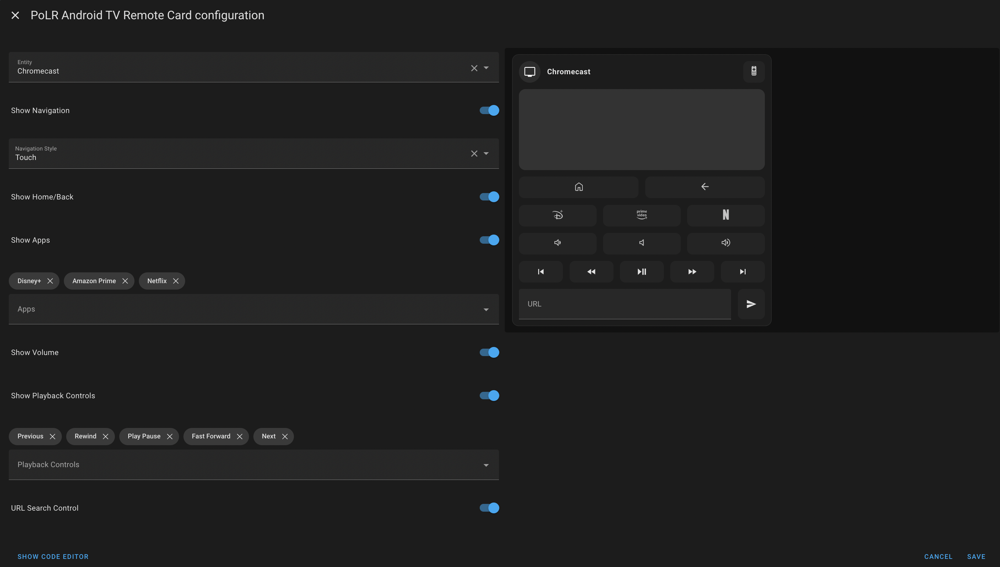

# polr-fox-card

A collection of Lovelace cards designed to improve your Home Assistant dashboard.

## Installation

### HACS

[](https://my.home-assistant.io/redirect/hacs_repository/?repository=polr-fox-card&category=Lovelace&owner=pathofleastresistor)

OR

1. Open the HACS section of Home Assistant.
2. Click the "..." button in the top right corner and select "Custom Repositories."
3. In the window that opens paste this Github URL.
4. Select "Lovelace"
5. In the window that opens when you select it click om "Install This Repository in HACS"

### Manually

1. Copy `polr-fox-card.js` into your `<config>/<www>` folder
2. Add `polr-fox-card.js` as a dashboard resource.

## Cards

| Card                        | Description                                    |
| --------------------------- | ---------------------------------------------- |
| PoLR Android TV Remote Card | Designed for the Android TV Remote integration |
| PoLR Birthday Card          | Show upcoming birthdays from Google Calendars  |

## PoLR Android TV Remote Card

### Settings

The card offers a GUI based editor, but in case you want to use YAML, see below.

<table>
    <tr>
        <th>Field</th>
        <th>Default</th>
        <th>Description</th>
    </tr>
    <tr>
        <td>entity__id</td>
        <td>n/a</td>
        <td>Must be a remote entity created by the new Android TV integration</td>
    </tr>
    <tr>
        <td>showRemote</td>
        <td>true</td>
        <td>true or false</td>
    </tr>
    <tr>
        <td>remote</td>
        <td>default</td>
        <td><code>default</code>, <code>dpad</code>, <code>touch</code></td>
    </tr>
    <tr>
        <td>showBasic</td>
        <td>true</td>
        <td>Shows a row of buttons for Home and back. true or false</td>
    </tr>
    <tr>
        <td>showApps</td>
        <td>true</td>
        <td></td>
    </tr>
    <tr>
        <td>apps</td>
        <td>
        </td>
        <td><code>disneyplus</code>, <code>hbomax</code>, <code>netflix</code>, <code>prime</code></td>
    </tr>
    <tr>
        <td>showVolume</td>
        <td>true</td>
        <td>Shows a row of buttons for Home and back. true or false</td>
    </tr>
    <tr>
        <td>showMedia</td>
        <td>true</td>
        <td>Shows a row of buttons for Home and back. true or false</td>
    </tr>
    <tr>
        <td>media_controls</td>
        <td>
        </td>
        <td><code>play</code>, <code>play_pause</code>, <code>stop</code>, <code>rewind</code>, <code>fast_forward</code></td>
    </tr>
</table>

### Custom apps

If the app you want isn't supported, you can still add it by including a `icon` and `url` in the `apps` array.

### Example

```
type: custom:polr-android-tv-remote-card
entity_id: remote.android_tv_remote
remote: touch
apps:
    - disneyplus
    - hbomax
    - netflix
    - prime
    - icon: mdi:youtube
      url: https://www.youtube.com
```

### Screenshot

<p align="center">
  
</p>

### Customization

It's still possible that the card isn't perfect for you so you need to make some customizations. Every button can be overridden to call a service, including custom apps.

| Button                     | YAML Key     |
| -------------------------- | ------------ |
| Up                         | `up`         |
| Down                       | `down`       |
| Left                       | `left`       |
| Right                      | `right`      |
| Center                     | `center`     |
| Power                      | `power`      |
| Home                       | `home`       |
| Back                       | `back`       |
| Favorite (only on default) | `favorite`   |
| Volume Up                  | `volumeup`   |
| Volume Down                | `volumedown` |
| Volume Mute                | `volumemute` |

Here's an example card config showing these overrides:

```
type: custom:polr-android-tv-remote-card
entity_id: remote.atvremote
remote: touch
apps:
  - service: remote.send_command
    data:
      command: volumedown
      device: livingroomtv
      entity_id: remote.living_room_ir_repeater
    icon: mdi:volume-low
power:
  service: remote.send_command
  data:
    command: power
    device: livingroomtv
    entity_id: remote.living_room_ir_repeater
up:
  service: remote.send_command
  data:
    command: up
    device: livingroomtv
    entity_id: remote.living_room_ir_repeater
down:
  service: remote.send_command
  data:
    command: down
    device: livingroomtv
    entity_id: remote.living_room_ir_repeater
left:
  service: remote.send_command
  data:
    command: left
    device: livingroomtv
    entity_id: remote.living_room_ir_repeater
right:
  service: remote.send_command
  data:
    command: right
    device: livingroomtv
    entity_id: remote.living_room_ir_repeater
back:
  service: remote.send_command
  data:
    command: back
    device: livingroomtv
    entity_id: remote.living_room_ir_repeater
center:
  service: remote.send_command
  data:
    command: center
    device: livingroomtv
    entity_id: remote.living_room_ir_repeater
volumedown:
  service: remote.send_command
  data:
    command: volumedown
    device: livingroomtv
    entity_id: remote.living_room_ir_repeater
volumeup:
  service: remote.send_command
  data:
    command: volumeup
    device: livingroomtv
    entity_id: remote.living_room_ir_repeater
```

Because you can also override custom apps, you could for example add a button to set the lights in room.

## PoLR Birthday Card

Designed to work specifically with the Google Calendar integration and the "Birthday" calendar that is automatically created from birthdays added to Google Contacts.

<table>
  <tr>
    <th>Field</th>
    <th>Default</th>
    <th>Description</th>
  </tr>
  <tr>
    <td>entity__id</td>
    <td>n/a</td>
    <td>Must be a calendar entity created by the Google Calendar integration</td>
  </tr>
  <tr>
    <td>name</td>
    <td>n/a</td>
    <td>title of card</td>
  </tr>
  </tr>
  <tr>
    <td>days</td>
    <td>14</td>
    <td>days to look ahead</td>
  </tr>
  </tr>
  <tr>
    <td>max</td>
    <td>5</td>
    <td>max number of entries to show</td>
  </tr>
</table>
